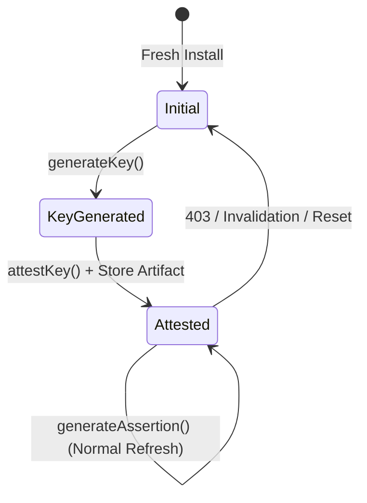

# App Check v12 (Swift Rewrite) — End-to-End Test Plan

Manual verification and bug bash guide for the `AppCheckCore` Objective-C to
Swift rewrite across Apple platforms.

---

## 1. Executive Summary & Strategy

The App Check v12 release migrates the core SDK (`google/app-check`) from
Objective-C to Swift. Unit tests validate logic in isolation, but end-to-end
(E2E) testing targets runtime interactions that unit tests cannot reach:

- Real Secure Enclave / `DCAppAttestService` hardware interactions.
- Real Apple Keychain access across lifecycle events and app upgrades.
- In-place upgrades from shipped v11 (Objective-C) builds without data loss.
- High-concurrency request coalescing, queuing, and backoff under real network
  conditions.
- Multi-threading, actor isolation, and language interop (Swift & Objective-C).

### Test Case Status Legend

| Tag | Category | Description |
| :--- | :--- | :--- |
| `[COMPAT]` | Data Compatibility | High risk. Verifies persistent state survives upgrade/downgrade. |
| `[FIX]` | Regression Target | Verifies specific bugs resolved during rewrite. |
| `[DECISION]` | Open Decision | Known behavioral divergence from v11 pending review. |
| `[CONCURRENCY]` | Concurrency | Multi-threaded stress and race condition validation. |

> [!IMPORTANT]
> Execute Section 3 (Cross-Version Data Compatibility) and Section 4 (App Attest
> Fresh Install) first. State loss or attestation failure on update are
> unrecoverable regressions for shipped applications.

---

## 2. Test Environment & Matrix

### Device & Platform Matrix

App Attest requires physical hardware with Secure Enclave support. Testing must
cover minimum deployment floors and current OS versions.

| Platform | Minimum Target | Target OS Matrix | Key Test Focus |
| :--- | :--- | :--- | :--- |
| **iOS** | 15.0 | iOS 15.x, iOS 17.x, iOS 18.x | App Attest, DeviceCheck, Upgrade |
| **macOS** | 11.0 | macOS 11.x, macOS 14.x, macOS 15.x | Keychain sharing, App Attest |
| **Mac Catalyst** | 15.0 | macOS 14.x / 15.x (Catalyst) | API parity, App Attest availability |
| **tvOS** | 15.0 | tvOS 15.x, tvOS 18.x | DeviceCheck / Debug fallback |
| **watchOS** | 8.0 / 9.0 | watchOS 8.x, watchOS 10.x, watchOS 11.x | App Attest (watchOS 9+ only) |

### Environment Configuration

Setup, secrets, and the exact Xcode and `xcodebuild` invocations for the
automated suite are in [E2E_TESTING.md](E2E_TESTING.md). For manual runs:

```sh
# Primary debug token (highest precedence)
export AppCheckDebugToken="<UUID-registered-in-Firebase-Console>"

# Legacy debug token (supported fallback)
export FIRAAppCheckDebugToken="<UUID-registered-in-Firebase-Console>"
```

### Backend & Fault Injection Setup

- **Charles / Proxyman / Mock Proxy**: Map backend endpoints to return mock
  status codes (`400`, `403`, `404`, `429`, `500`, `503`) and malformed
  payloads.
- **Network Link Conditioner**: Simulate packet loss, DNS failure, high latency,
  and offline status mid-handshake.

---

## 3. Cross-Version Data Compatibility & Migration

> [!CAUTION]
> Install a **v11 (Objective-C) build first**, perform initial token fetches and
> attestations, and then install the **v12 (Swift) build in place**. Do not
> start from a clean install for migration test cases.

### Persistent Identifiers

| Resource | Target Key / Identifier |
| :--- | :--- |
| **Token Keychain Service** | `com.google.app_check_core.token_storage` |
| **Artifact Keychain Service** | `com.firebase.app_check.app_attest_artifact_storage` |
| **Key ID Suite Name** | `com.firebase.GACAppAttestKeyIDStorage` |
| **Debug Token Key** | `GACAppCheckDebugToken` |
| **Debug Registered Flag** | `GACAppCheckDebugTokenRegistered_<service>_<resource>` |
| **Core Error Domain** | `com.google.app_check_core` |

### Migration Procedures

| ID | Tag | Test Case | Execution Steps | Expected Outcome |
| :--- | :---: | :--- | :--- | :--- |
| **MIG-01** | `[COMPAT]` | **Cached Token Upgrade** | 1. Run v11 build.<br>2. Fetch token via provider.<br>3. Terminate app.<br>4. Install v12 build over v11.<br>5. Call `token(forcingRefresh: false)`. | Decodes legacy `GACAppCheckStoredToken` archive. Returns identical cached token without network call until expiration. |
| **MIG-02** | `[COMPAT]` | **App Attest Key ID Upgrade** | 1. Run v11 build and complete App Attest handshake.<br>2. Install v12 over v11.<br>3. Request token. | Reuses existing Key ID in UserDefaults suite `com.firebase.GACAppAttestKeyIDStorage`. No `generateKey()` called. |
| **MIG-03** | `[COMPAT]` | **Attest Artifact Upgrade** | 1. Run v11 build through attestation.<br>2. Install v12.<br>3. Inspect request body during token fetch. | Decodes legacy `GACAppAttestStoredArtifact`. Executes assertion flow; does not trigger new attestation. |
| **MIG-04** | `[COMPAT]` | **Debug Token Upgrade** | 1. Run v11 with generated debug token.<br>2. Verify token in console.<br>3. Upgrade to v12. | Same debug UUID persists and is reused from UserDefaults. No new UUID generated. |
| **MIG-05** | `[COMPAT]` | **Keychain Group Sharing** | 1. Configure app and extension with shared access group.<br>2. Fetch token in main app.<br>3. Fetch token in extension. | Both processes access the shared Keychain item without collision or permission denial. |
| **MIG-06** | `[COMPAT]` | **Downgrade Safety** | 1. Run v12 build and fetch token.<br>2. Install v11 build over v12.<br>3. Request token in v11. | v11 decodes the token written by v12 without crashing or losing state. |
| **MIG-07** | | **Corrupted Token Keychain** | 1. Inject random bytes into token Keychain item.<br>2. Call `token(forcingRefresh: false)`. | Unarchiving fails without throwing; treated as cache miss. Fetches fresh token. No crash. |
| **MIG-08** | | **Corrupted Artifact Recovery** | 1. Corrupt artifact Keychain payload.<br>2. Request token. | Falls back to initial attestation handshake. State resets; no permanent failure. |
| **MIG-09** | | **Key ID Present, Artifact Lost** | 1. Delete artifact Keychain entry while leaving Key ID in UserDefaults.<br>2. Request token. | Detects missing artifact, transitions to `keyGenerated` state, and re-attests the existing key. |
| **MIG-10** | `[FIX]` | **Keychain Access Denied** | 1. Deny Keychain access mid-session via OS policy.<br>2. Request token. | Falls back to re-attestation; does not crash or loop indefinitely. |
| **MIG-11** | | **Pre-First-Unlock Access** | 1. Trigger token fetch after reboot before first user unlock. | Returns Keychain error (`AppCheckCoreErrorCode.keychain`). No hang, crash, or memory leak. |
| **MIG-12** | `[COMPAT]` | **Storage Address Parity** | 1. Configure FirebaseApp and request token.<br>2. Read Keychain directly via `SecItemCopyMatching`. | Token lands at the exact v11 Keychain service and account key address. Key derivation has not drifted. |

---

## 4. App Attest Provider State Machine

> [!NOTE]
> Requires a physical device (iPhone / iPad with iOS 14.0+). App Attest is
> unsupported on Simulators.



| ID | Tag | Test Case | Execution Steps | Expected Outcome |
| :--- | :---: | :--- | :--- | :--- |
| **ATT-01** | `[FIX]` | **Fresh Install Attestation** | 1. Clean install on physical device.<br>2. Call `getToken()`. | Generates key -> exchanges challenge -> attests key with Apple -> stores Key ID & artifact -> returns token. Fixed fresh install regression. |
| **ATT-02** | | **Subsequent Launch Assertion** | 1. Complete ATT-01.<br>2. Terminate and relaunch app.<br>3. Call `getToken()`. | Reuses stored key and artifact. Executes assertion request. No `generateKey()` call. |
| **ATT-03** | | **Limited-Use Token Flow** | 1. Call `getLimitedUseToken()`. | Requests single-use token. Request body contains `limited_use: true`. Leaves cached regular token intact. |
| **ATT-04** | | **Sequential Limited-Use Tokens** | 1. Request two consecutive limited-use tokens. | Returns two distinct token strings. |
| **ATT-05** | | **Attestation 403 Rejection** | 1. Intercept attestation exchange and return HTTP 403.<br>2. Observe retry behavior. | Deletes local Key ID and artifact. Retries handshake once. If failure persists, throws error. |
| **ATT-06** | | **Assertion Invalid Key Recovery** | 1. Invalidate key on server.<br>2. Request token. | Catches `DCErrorInvalidKey`. Clears state, restarts initial attestation, and succeeds on retry. |
| **ATT-07** | | **Bounded Retry Guarantee** | 1. Force permanent rejection on attestation endpoint. | Two network attempts total. No infinite recursion or continuous key generation. |
| **ATT-08** | | **Apple Service Outage** | 1. Mock `DCErrorServerUnavailable` from Apple. | Operation fails with underlying error. Existing key and artifact are preserved (protects device risk metric). |
| **ATT-09** | | **Unsupported Device / Simulator** | 1. Run on iOS Simulator. | Returns `AppCheckCoreErrorCode.unsupported` (code 4). No attestation attempted. |
| **ATT-10** | | **Offline During Handshake** | 1. Enable Airplane Mode between challenge fetch and attestation payload. | Returns network error. Partial state removed. Completes when connection restores. |

---

## 5. Core Token Lifecycle & Request Coalescing

| ID | Tag | Test Case | Execution Steps | Expected Outcome |
| :--- | :---: | :--- | :--- | :--- |
| **COR-01** | | **Cold Start Fetch** | 1. Clear app cache.<br>2. Request token `forcingRefresh: false`. | Backend network call dispatched. Returns valid token with matching server TTL. Token persisted to Keychain. |
| **COR-02** | | **Cached Token Retrieval** | 1. Complete COR-01.<br>2. Call `token(forcingRefresh: false)` within validity window. | Returns cached token without network requests. |
| **COR-03** | | **Forced Refresh** | 1. Cached token present.<br>2. Call `token(forcingRefresh: true)`. | Cache bypassed. Fresh backend call executed. New token replaces Keychain entry. Expiry updated. |
| **COR-04** | | **Proactive Near-Expiry Refresh** | 1. Inject cached token expiring in 4 minutes.<br>2. Request token `forcingRefresh: false`. | Identifies token within 5-minute expiry window. Triggers background refresh and returns new token. |
| **COR-05** | `[CONCURRENCY]` | **10 Concurrent Standard Calls** | 1. Clear cache.<br>2. Dispatch 10 parallel asynchronous `token(forcingRefresh: false)` calls. | One network request issued. All 10 callers await the single task and receive the same token. |
| **COR-06** | `[CONCURRENCY]` | **10 Concurrent Limited-Use Calls**| 1. Dispatch 10 parallel calls to `limitedUseToken()`. | 10 distinct tokens returned. Requests execute sequentially without coalescing. |
| **COR-07** | `[CONCURRENCY]` | **Mixed Standard & Limited-Use** | 1. Fire standard and limited-use requests in parallel. | Standard calls coalesce. Limited-use calls chain independently. Neither receives incorrect token type. |
| **COR-08** | `[FIX]` | **In-Flight Failure Coalescing** | 1. Start in-flight fetch.<br>2. Queue 5 callers.<br>3. Force network failure. | All queued callers fail with the same underlying error. Queued callers do not launch separate retries. |
| **COR-09** | `[CONCURRENCY]` | **Multi-Threaded Stress Test** | 1. Spawn 100 concurrent tasks across arbitrary dispatch queues with 50ms latency. | Zero deadlocks, zero data races. Verify with Thread Sanitizer (TSan). |
| **COR-10** | | **Provider Deallocation Mid-Flight**| 1. Initiate fetch and release provider reference. | No crash, dangling pointer, or memory leak. |

---

## 6. Auto-Refresh Engine & Backoff Wrapper

### Refresh Formula & Backoff Schedule

- **Auto-Refresh Trigger Date**: `T0 + (TTL * 0.5) + 300s` (50% of TTL plus 5
  minutes).
- **Refresh Failure Retry Schedule**: `30s` -> `60s` -> `120s` ... capped at
  `960s` (16 minutes) with jitter (0-1000ms).
- **Backend HTTP Error Backoff**:
  - `400 / 404`: 1 day client-side backoff (fail-fast without network).
  - `403 / 429 / 500 / 503`: Exponential backoff (`1s`, `2s`, `4s`... capped at
    4 hours, jitter up to 1.5x).
  - `Network / DCError`: No backoff (immediate retry allowed on connection
    recovery).

### Refresh Procedures

| ID | Tag | Test Case | Execution Steps | Expected Outcome |
| :--- | :---: | :--- | :--- | :--- |
| **REF-01** | | **Auto-Refresh Scheduling** | 1. Receive token with 1-hour TTL.<br>2. Inspect scheduled timer. | Timer set for 35 minutes after receipt (`T0 + 1800s + 300s`). |
| **REF-02** | | **Delegate Notification** | 1. Monitor `GACAppCheckTokenDelegate`.<br>2. Let auto-refresh trigger. | `tokenDidUpdate:serviceName:` fires with new token and matching service name. |
| **REF-03** | | **Auto-Refresh Disabled** | 1. Set `isTokenAutoRefreshEnabled = false`.<br>2. Advance time past refresh date. | Timer remains inactive. No background network requests dispatched. |
| **REF-04** | | **Refresh Failure Backoff** | 1. Force HTTP 500 on auto-refresh.<br>2. Observe retry intervals. | Follows `30s` -> `60s` -> `120s` sequence up to `960s` ceiling. |
| **REF-05** | | **HTTP 400 / 404 Fail-Fast** | 1. Mock HTTP 400 response.<br>2. Call `getToken()`. | Call fails with backoff error without network traffic. Backoff set to 1 day. |
| **REF-06** | | **HTTP 403 / 429 / 503 Backoff** | 1. Mock HTTP 429 response.<br>2. Measure retry spacing. | Retries back off exponentially up to 4-hour ceiling. |
| **REF-07** | | **App Backgrounding & Resume** | 1. Schedule refresh.<br>2. Background app across deadline.<br>3. Foreground app. | Refresh executes on resume. No duplicate timers or leaks. |
| **REF-08** | | **Clock Skew Resilience** | 1. Adjust device clock +2 hours, then -2 hours across refresh boundaries. | Expiry evaluated against initial request timestamp. No infinite refresh loops. |

---

## 7. Provider Implementations

### Debug Provider

| ID | Tag | Test Case | Execution Steps | Expected Outcome |
| :--- | :---: | :--- | :--- | :--- |
| **DBG-01** | | **Auto-Generated Debug Token** | 1. Clean UserDefaults, no env vars.<br>2. Instantiate debug provider. | Random UUID generated and stored in `GACAppCheckDebugToken`. Warning logged with UUID. |
| **DBG-02** | | **Environment Variable Override** | 1. Set `AppCheckDebugToken="UUID-PRIMARY"`. | Returns `"UUID-PRIMARY"`. Uses variable value. |
| **DBG-03** | | **Legacy Variable Fallback** | 1. Unset `AppCheckDebugToken`.<br>2. Set `FIRAAppCheckDebugToken="UUID-LEGACY"`. | Returns `"UUID-LEGACY"`. Emits legacy fallback log. |
| **DBG-04** | | **Variable Precedence** | 1. Set both `AppCheckDebugToken` and `FIRAAppCheckDebugToken`. | `AppCheckDebugToken` takes precedence. Warning code `4003` logged. |
| **DBG-05** | | **Registration Flag Persistence**| 1. Register UUID in console and exchange.<br>2. Relaunch app. | `GACAppCheckDebugTokenRegistered_<svc>_<res>` written to UserDefaults. Console warning suppressed on subsequent launch. |
| **DBG-06** | | **Unregistered Token 403** | 1. Pass unregistered UUID to backend. | Backend returns HTTP 403. Registration flag remains unset. |
| **DBG-07** | `[FIX]` | **Release Build Log Redaction** | 1. Build in Release configuration (`-c release`).<br>2. Inspect system log. | Debug token is absent from console logs. Fixed `#if !NDEBUG` leak. |

### DeviceCheck & reCAPTCHA Enterprise

| ID | Tag | Test Case | Execution Steps | Expected Outcome |
| :--- | :---: | :--- | :--- | :--- |
| **DVC-01** | | **DeviceCheck Token Exchange** | 1. Physical device with valid API key.<br>2. Call `getToken()`. | `DCDevice.current.generateToken` produces token. Backend exchanges token for App Check token. |
| **DVC-02** | | **DeviceCheck Unsupported** | 1. Run DeviceCheck on Simulator. | Returns `AppCheckCoreErrorCode.unsupported` (code 4). |
| **RCP-01** | | **reCAPTCHA Token Generation** | 1. Target iOS 15.0+ with `RecaptchaEnterprise` linked and valid site key. | Provider initializes action `"app_check_ios"` and exchanges token. |
| **RCP-02** | | **Unlinked reCAPTCHA SDK** | 1. Build test harness without `RecaptchaEnterprise` framework. | Initializer returns `nil`. `AppCheckRecaptchaProvider.isSupported()` returns `false`. No runtime crash. |
| **RCP-03** | | **Invalid Site Key** | 1. Configure invalid reCAPTCHA site key. | Returns error; triggers exponential backoff. |

---

## 8. Language Interoperability, Typing & Threading

| ID | Tag | Test Case | Execution Steps | Expected Outcome |
| :--- | :---: | :--- | :--- | :--- |
| **INT-01** | | **Objective-C Public API** | 1. In Objective-C, `#import <AppCheckCore/AppCheckCore.h>`.<br>2. Call `-[GACAppCheck tokenForcingRefresh:completion:]`. | Block receives `GACAppCheckTokenResult`. Properties `token`, `expirationDate`, and `error` bridge to Objective-C. |
| **INT-02** | | **Swift Async/Await API** | 1. In Swift, call `try await appCheck.token(forcingRefresh: false)`. | Async task suspends during network call and resumes with non-optional `AppCheckCoreToken`. Throws native error on failure. |
| **INT-03** | | **ObjC Error Domain & Codes** | 1. Inspect error returned in ObjC.<br>2. Compare domain and code. | `error.domain == GACAppCheckErrors.errorDomain == @"com.google.app_check_core"`. Error codes match raw values 0-4. |
| **INT-04** | `[DECISION]` | **Swift Typed Error Catching** | 1. In Swift: `catch AppCheckCoreErrorCode.unsupported`. | Known divergence: Verify whether caught as typed enum or generic `NSError`. Record against decision #2. |
| **INT-05** | `[DECISION]` | **Completion Queue Isolation** | 1. Call `token(forcingRefresh:completion:)` with Main Thread Checker enabled.<br>2. Update UI in completion block. | Verify whether completion handler executes on Main Thread (v11 behavior) or background thread. |
| **INT-06** | `[DECISION]` | **Delegate Callback Queue** | 1. Trigger auto-refresh and inspect thread inside `tokenDidUpdate:serviceName:`. | Document whether delegate fires on Main Thread (v11) or background queue. |

---

## 9. Automated Coverage

The `FIRAppCheckTestAppTests` target automates the cases below. Each test's doc
comment starts with the case ID it covers. See [E2E_TESTING.md](E2E_TESTING.md)
for how to run them.

| Case | Suite | Test | Runs on |
| :--- | :--- | :--- | :--- |
| ATT-01 | App Attest provider tests | App Attest provider requests token on physical hardware | Device |
| ATT-03 | App Attest provider tests | App Attest provider requests limited use token on physical hardware | Device |
| ATT-09 | App Attest provider tests | App Attest provider fails safely on Simulator (and limited-use variant) | Simulator |
| COR-01 to COR-10 | Core token lifecycle | One test per case | Both |
| REF-02 | Auto-refresh tests | Token update notification fires when auto-refresh is enabled | Both |
| REF-03 | Auto-refresh tests | Auto-refresh disabled property state is respected | Both |
| DBG-05 | Debug provider tests | Registered debug token exchanges successfully (exchange half) | Both |
| DBG-06 | Debug provider tests | Unregistered debug token fails exchange with 403 | Both |
| DVC-01 | DeviceCheck provider tests | DeviceCheck provider requests token on physical hardware (and limited-use variant) | Device |
| DVC-02 | DeviceCheck provider tests | DeviceCheck returns unsupported on Simulator (and limited-use variant) | Simulator |
| RCP-01 | Recaptcha provider tests | Recaptcha provider initializes and requests token; requests limited use token | Device |
| RCP-02 | Recaptcha provider tests | Recaptcha provider initializes when linked (linked half) | Both |
| INT-01, INT-03 | `AppCheckObjCAPITests` (XCTest, Objective-C) | All four tests | Both |
| INT-02 to INT-06 | Language interoperability | One or two tests per case | Both |
| MIG-07 | Legacy storage address parity | Corrupted token in keychain is recovered safely | Both |
| MIG-12 | Legacy storage address parity | Composed addresses match the v11 contract; Storage service identifiers are unchanged; Token lands at the v11 keychain address | Both |
| (none) | Public API contract | Pins error domain, error codes, notification name and keys, and the auto-refresh opt-out key to literals | Both |
| (none) | `FIRAppCheckTestAppTests` (XCTest) | Live token fetch, cache, forced refresh, and limited-use through the host app's default app | Both |

Not automated in this target:

- **Manual, physical device or install sequence:** MIG-01 to MIG-06, MIG-08 to
  MIG-11, ATT-02 (beyond repeat runs of ATT-01), ATT-04 to ATT-08, ATT-10,
  REF-07, DBG-07, RCP-03.
- **Better covered by app-check unit tests,** which can inject timers and the
  environment: REF-01, REF-04 to REF-06, REF-08, DBG-01 to DBG-04. The legacy
  archive decoding behind MIG-01 to MIG-04 is also covered there, using
  fixtures produced by the v11 Objective-C code.

Expected results with all prerequisites configured:

| Destination | Passed | Skipped | Skipped tests |
| :--- | ---: | ---: | :--- |
| Simulator | 45 | 6 | Physical-hardware tests: ATT-01, ATT-03, DVC-01 (×2), RCP-01 (×2) |
| Device | 47 | 4 | Simulator-only tests: ATT-09 (×2), DVC-02 (×2) |

---

## 10. Priority Execution Plan

When time is constrained prior to code freeze, execute these cases in order:

1. **MIG-01, MIG-02, MIG-03**: Cross-version data migration from v11 `[COMPAT]`
2. **ATT-01**: Fresh-install App Attest handshake on physical device `[FIX]`
3. **DBG-07**: Verify debug token is redacted in Release build logs `[FIX]`
4. **COR-08**: In-flight failure coalescing without queue stampede `[FIX]`
5. **ATT-08**: State preservation during Apple service outage
6. **REF-08**: Clock skew handling across refresh boundaries
7. **INT-05**: Completion handler callback thread verification `[DECISION]`

---

## 11. Bug Triage & Reporting Template

Determine whether an issue is a regression from v11 or pre-existing behavior by
testing reproduction steps against v11.3.2.

```markdown
### [BUG] <Short Descriptive Title>

- **Test ID**: (e.g. ATT-01, MIG-04, or NEW)
- **Classification**: [COMPAT] Data Loss | [FIX] Regression | [CONCURRENCY] Concurrency | [DECISION] Behavioral Change
- **Platform & OS**: iOS 18.1 / iPhone 15 Pro
- **Build Configuration**: Debug / Release
- **Provider Under Test**: AppAttest | DeviceCheck | Debug | Recaptcha
- **Execution Path**: Clean Install | In-Place Upgrade from v11.3.2

#### Reproduction Steps
1. ...
2. ...
3. ...

#### Expected Result
...

#### Actual Result
...

#### Diagnostics & State
- **Console Logs**: (AppCheckCoreLogger.logLevel = .debug)
- **Keychain Records**: (Service / Account values)
- **UserDefaults Entries**:

#### v11 Parity Check
- [ ] Reproduces on v11.3.2 (Pre-existing behavior)
- [ ] Passes on v11.3.2 (Regression introduced in Swift rewrite)
```
