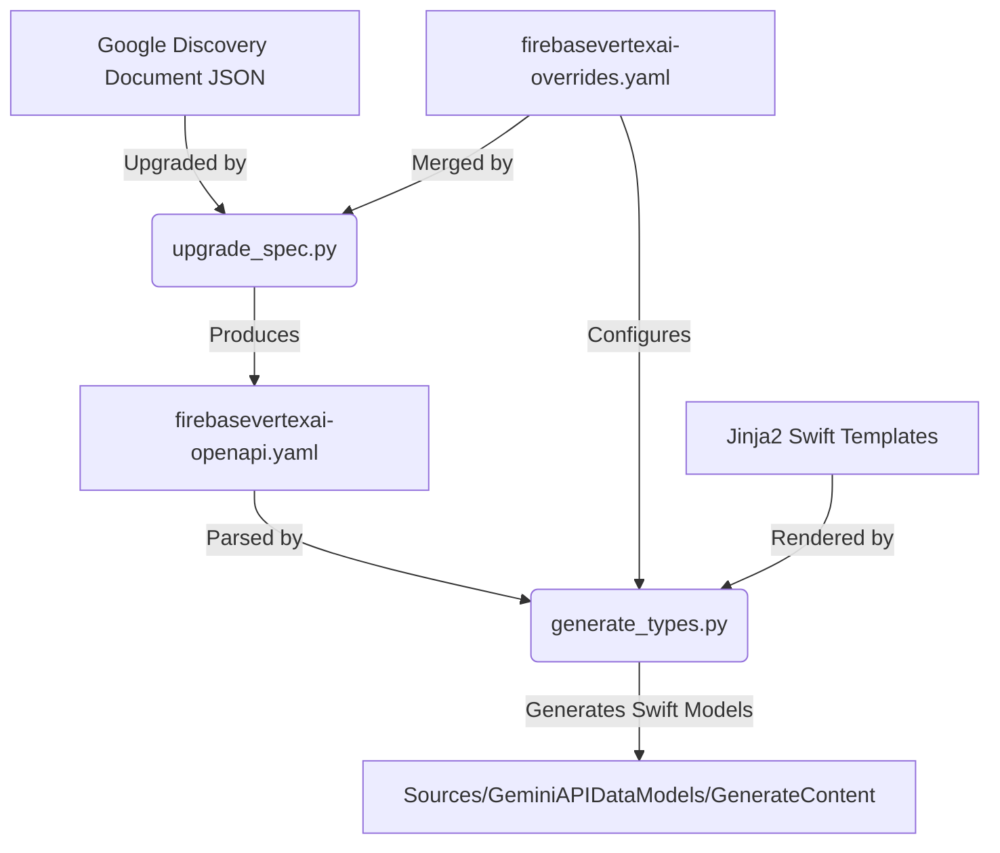

# Swift type generation (`typegen`)

This directory contains the OpenAPI 3.1.0 upgrade and Swift code generation
pipeline used to generate the data models in
`GeminiLanguageModel/Sources/GeminiAPIDataModels/GenerateContent`.

---

## Architecture and code generation workflow



## Setup

From `GeminiLanguageModel/scripts/typegen`:

```bash
python3 -m venv .venv
source .venv/bin/activate
pip install -r requirements.txt
```

---

## 1. Upgrading the specification (`upgrade_spec.py`)

Before generating types, convert the Google Discovery Document to an
OpenAPI 3.1.0 specification and apply manual overrides:

```bash
python upgrade_spec.py
```

If `discovery_documents/firebasevertexai_discovery_v1beta.json` is not cached
locally, `upgrade_spec.py` automatically downloads it from Google APIs. To
force a fresh download of the latest Discovery Document even when cached:

```bash
python upgrade_spec.py --fetch
```

This script loads `firebasevertexai_discovery_v1beta.json`, normalizes schema
references, extracts shared standalone enums (such as `HarmCategory`,
`Modality`, and `DataType`), infers required fields, merges manual overrides
from `firebasevertexai-overrides.yaml`, and writes
`discovery_documents/firebasevertexai-openapi.yaml` (both the fetched `.json`
and generated `-openapi.yaml` files are gitignored).

---

## 2. Generating Swift types (`generate_types.py`)

Use [generate_types.py](generate_types.py) to parse the upgraded OpenAPI 3.1.0
specification and write Swift types directly into
`GeminiLanguageModel/Sources/GeminiAPIDataModels/GenerateContent`:

```bash
python generate_types.py
```

### Command-line arguments reference

| Argument | Default | Description |
| :--- | :--- | :--- |
| `--openapi-spec` | `discovery_documents/firebasevertexai-openapi.yaml` | Upgraded spec YAML path. |
| `--overrides-file` | `discovery_documents/firebasevertexai-overrides.yaml` | YAML overrides file path. |
| `--output-dir` | `../../Sources/GeminiAPIDataModels/GenerateContent` | Output directory. |
| `--roots` | `["GenerateContentRequest", ...]` | Roots to resolve. |
| `--access-level` | `package` | Swift access control: `public`, `package`, or `internal`. |
| `--strip-prefix` | all `generatorConfig.backends` | Backend prefixes to strip and merge (pass with no values to disable). |
| `--namespace` | `""` | Swift root namespace. |
| `--shared-models-target` | `""` | Shared models target. |
| `--templates-dir` | `templates` | Jinja2 templates folder. |
| `--doc-wrap-width` | `100` | Maximum column width for DocC comments. |
| `--verbose` | `false` | Enable verbose output. |

The overrides file is required: the generator exits with an error if it is
missing, rather than generating a much smaller type set and pruning existing
output. Each `--strip-prefix` value must be listed in
`generatorConfig.backends`. If no backends are configured, the generator exits
with an error unless `--strip-prefix` is passed with no values. Backends are
always merged Developer API (`gl-developer`) first, regardless of argument or
config order.

### Code layout

`generate_types.py` is a thin entry point. The implementation lives in the
[`swift_typegen`](swift_typegen) package:

| Module | Responsibility |
| :--- | :--- |
| `cli.py` | Argument parsing; builds `PipelineOptions`. |
| `pipeline.py` | Orchestration: load → per-backend preprocess → merge → cycle check → process → write. |
| `config.py` | `GeneratorConfig`, loaded from the overrides YAML `generatorConfig` block (including `backends` prefixes/tags and `preservedFiles`). |
| `merge.py` | Backend prefix stripping, schema renaming, and cross-backend schema merging. |
| `graph.py` | `$ref` traversal, reachability from roots, and cycle detection. |
| `processor.py` | `SchemaProcessor`: OpenAPI schemas → `SwiftType` models. |
| `models.py` | `SwiftType`, `SwiftProperty`, `SwiftEnumCase`. |
| `naming.py` | Swift identifier casing, acronyms, and keyword escaping. |
| `docc.py` | DocC comment extraction, cleanup, and wrapping. |
| `render.py` | Jinja2 rendering to `(filename, source)` with no file I/O. |
| `output.py` | Writing files, `swift-format`, and pruning stale outputs. |

---

## 3. Running unit tests

From `GeminiLanguageModel/scripts/typegen/`:

```bash
python -m unittest discover -s tests -t .
```

Or from anywhere in the repository:

```bash
python -m unittest discover \
  -s GeminiLanguageModel/scripts/typegen/tests \
  -t GeminiLanguageModel/scripts/typegen
```
