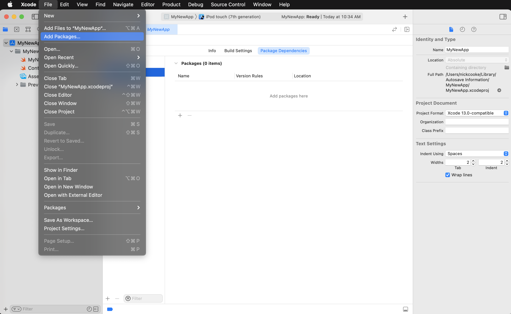
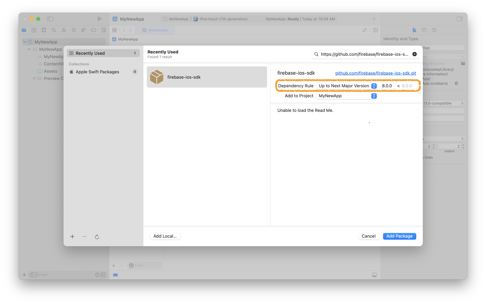
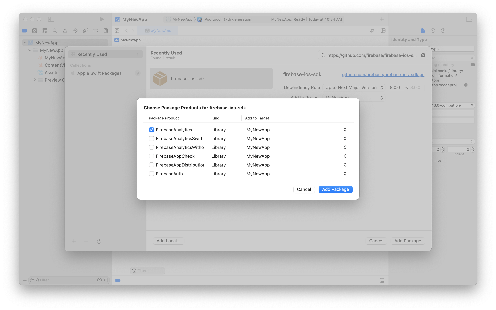
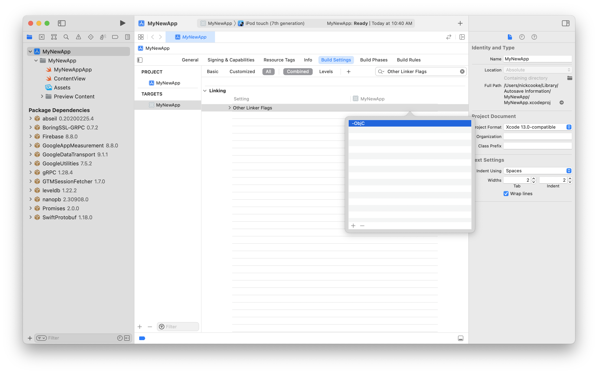

# Swift Package Manager for Firebase

## Requirements

- Requires Xcode 15.2 or above
- Analytics requires clients to add `-ObjC` linker option.
- See [Package.swift](Package.swift) for supported platform versions.

## Limitations

- Product availability varies by platform. See [the chart on this page](https://firebase.google.com/docs/ios/learn-more#firebase_library_support_by_platform)
  for information on product availability for each platform.

## Installation

> If you've previously used CocoaPods, remove them from the project with `pod deintegrate`.

### Installing from Xcode

Add a package by selecting `File` → `Add Packages…` in Xcode’s menu bar.



---

Search for the Firebase Apple SDK using the repo's URL:
```console
https://github.com/firebase/firebase-ios-sdk.git
```

Next, set the **Dependency Rule** to be `Up to Next Major Version`.

Then, select **Add Package**.



---

Choose the Firebase products that you want installed in your app.



---

If you've installed **FirebaseAnalytics**, add the `-ObjC` option to `Other Linker Flags`
in the `Build Settings` tab.



---

If you're using FirebaseCrashlytics, you can use
`${BUILD_DIR%/Build/*}/SourcePackages/checkouts/firebase-ios-sdk/Crashlytics/run`
as the run script that allows Xcode to upload your project's dSYM files.

Another option is to use the
[upload-symbols](https://github.com/firebase/firebase-ios-sdk/raw/main/Crashlytics/upload-symbols)
script. Place it in the directory where your `.xcodeproj` file lives,
eg. `scripts/upload-symbols`, and make sure that the file is executable:
`chmod +x scripts/upload-symbols`.
This script can be used to manually upload dSYM files (for usage notes and
additional instructions, run with the `--help` parameter).

If you're getting `error: Could not get GOOGLE_APP_ID in Google Services file from build environment` on the Crashlytics run script step and you're using Xcode 15 and specifically `User Script Sandboxing = YES`, make sure to include all input files referenced [here](https://github.com/firebase/firebase-ios-sdk/pull/11463) in the Crashlytics run script.

---

### Alternatively, add Firebase to a `Package.swift` manifest

To integrate via a `Package.swift` manifest instead of Xcode, you can add
Firebase to the dependencies array of your package:

```swift
dependencies: [
  .package(
    name: "Firebase",
    url: "https://github.com/firebase/firebase-ios-sdk.git",
    .upToNextMajor(from: "10.4.0")
  ),

  // Any other dependencies you have...
],
```

Then, in any target that depends on a Firebase product, add it to the `dependencies`
array of that target:

```swift
.target(
  name: "MyTargetName",
  dependencies: [
    // The product(s) you want (e.g. FirebaseAuth).
    .product(name: "FirebaseAuth", package: "Firebase"),
  ]
),
```

## Questions and Issues

Please provide any feedback via a [GitHub
Issue](https://github.com/firebase/firebase-ios-sdk/issues/new?template=bug_report.md).

See current open Swift Package Manager issues
[here]([https://github.com/firebase/firebase-ios-sdk/labels/Swift%20Package%20Manager](https://github.com/firebase/firebase-ios-sdk/issues?q=is%3Aopen+label%3A%22Swift+Package+Manager%22+sort%3Acomments-desc)).
