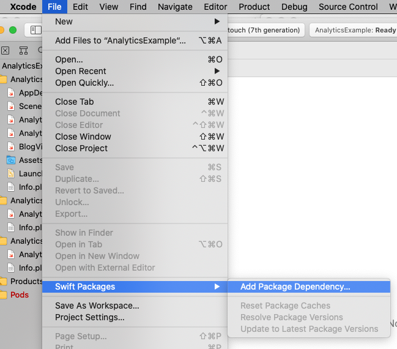
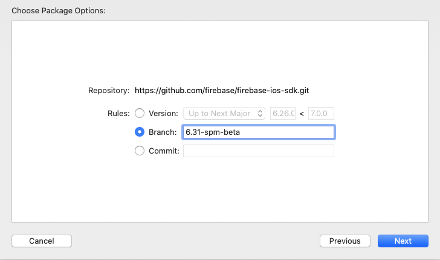
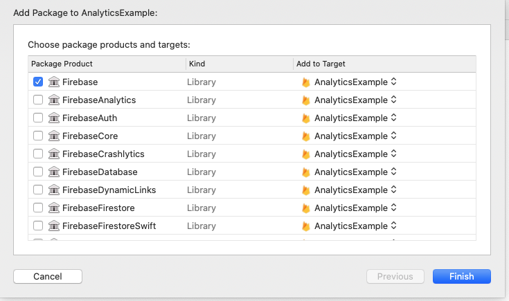
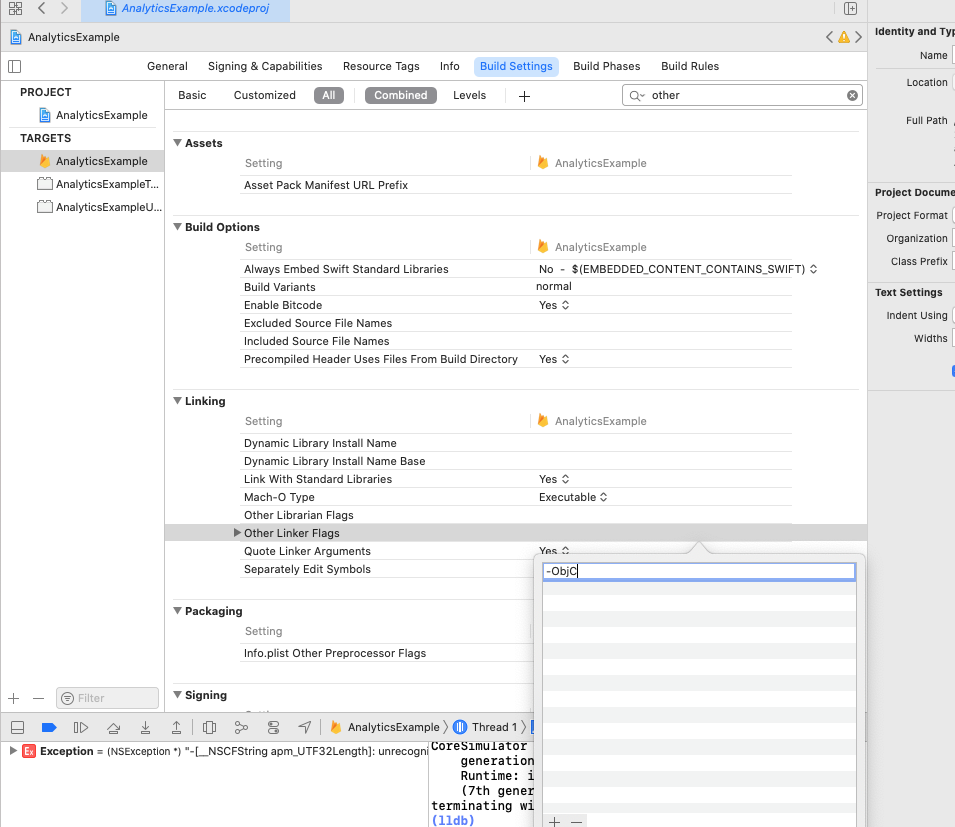

# Swift Package Manager for Firebase

## Introduction

Starting with the 8.0.0 release, Firebase officially supports installation via [Swift
Package Manager](https://swift.org/package-manager/).

Prior to version 8.0.0 (starting with version 6.31.0) support was in Beta.

## Requirements

- Requires Xcode 12.5
- Analytics requires clients to add `-ObjC` linker option.
- See [Package.swift](Package.swift) for supported platform versions.

## Limitations

- Analytics is only supported for iOS and cannot be used in apps that support other platforms.
- watchOS support is available for Auth, Crashlytics, Messaging, Realtime Database, RemoteConfig,
  and Storage.

## Installation

If you've previously used CocoaPods, remove them from the project with `pod deintegrate`.

### In Xcode

Install Firebase via Swift Package Manager:



Select the Firebase GitHub repository - `https://github.com/firebase/firebase-ios-sdk.git`:


Select the version.

Note: The Swift Package Manager distribution continues to be in beta even though it now
supports standard Swift Package Manager versioning.



Choose the Firebase products that you want installed in your app.



If you've installed FirebaseAnalytics, Add the `-ObjC` option to `Other Linker Flags`
in the `Build Settings` tab.



If you're using FirebaseCrashlytics, you can use
`${BUILD_DIR%/Build/*}/SourcePackages/checkouts/firebase-ios-sdk/Crashlytics/run`
as the run script that allows Xcode to upload your project's dSYM files.

Another option is to use the
[upload-symbols](https://github.com/firebase/firebase-ios-sdk/raw/master/Crashlytics/upload-symbols)
script. Place it in the directory where your `.xcodeproj` file lives,
eg. `scripts/upload-symbols`, and make sure that the file is executable:
`chmod +x scripts/upload-symbols`.
This script can be used to manually upload dSYM files (for usage notes and
additional instructions, run with the `--help` parameter).

### Alternatively, add Firebase to a `Package.swift` manifest

To integrate via a `Package.swift` manifest instead of Xcode, you can add
Firebase to your dependencies array of your package with:

```
dependencies: [
  // Substitute X.Y with the version of Firebase you want.
  .package(name: "Firebase",
           url: "https://github.com/firebase/firebase-ios-sdk.git",
           .branch("X.Y-spm-beta")),

  // Any other dependencies you have...
],
```

Then in any target that depends on a Firebase product, add it to the `dependencies`
array of that target:

```
.target(
    name: "MyTargetName",
    dependencies: [
      // The product name you need. In this example, FirebaseAuth.
      .product(name: "FirebaseAuth", package: "Firebase"),
    ]
),
```

## Questions and Issues

Please provide any feedback via a [GitHub
Issue](https://github.com/firebase/firebase-ios-sdk/issues/new?template=bug_report.md).

See current open Swift Package Manager issues
[here](https://github.com/firebase/firebase-ios-sdk/labels/Swift%20Package%20Manager).
