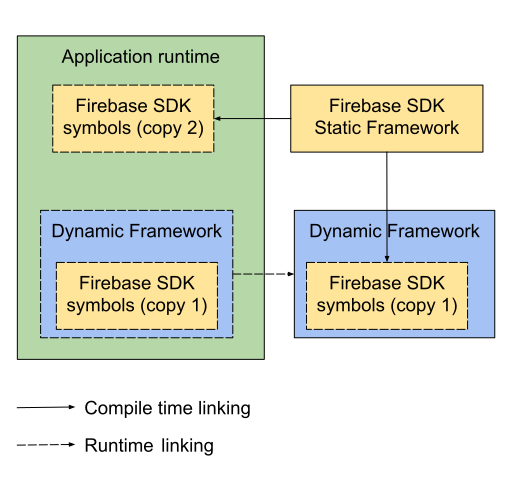
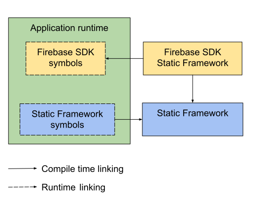

# Introduction

Before the 7.0 release, all source code and binary Firebase SDKs are compiled as static frameworks.
With Firebase 7.0, CocoaPods developers can control whether Firebase is linked statically or
dynamically from the `Podfile`. Use the Podfile option `use_frameworks! :linkage => :static` to get
the Firebase 6.x linkage behavior.

The 7.x update applies to all Firebase libraries except
FirebaseAnalytics, which continues to be distributed as a binary static framework.

The zip and Carthage distributions continue to only be built for static linking.

The Swift Package Manager distribution follows the Swift Package Manager defaults which is
currently static linking.

# Using Firebase from a framework or a library

 Most of the time you’ll link Firebase frameworks directly to your app targets, but in some cases
it makes sense to link Firebase frameworks to your app indirectly, from another library or
another framework. This note talks about some of the pitfalls of this technique, almost
always hard-to-debug undefined behaviors, that all come down to code duplication and how
static and dynamic linking work. Your framework itself may be either static or dynamic. Let's
consider these two options in more detail.

## Using Firebase SDKs from dynamic frameworks

A dynamic framework is a bundle containing dynamic libraries and other resources. The dynamic
libraries bundled in the framework can themselves be compiled from static libraries, like
Firebase core and product libraries, meaning all of the symbols of the static libraries are
part of the dynamic framework bundle. What if your core app already directly links a static
Firebase library when you link to the same library indirectly from a dynamic framework? Well,
you end up with duplicate symbols in your app. This leads to undefined behavior (especially
when different versions of the static framework are linked to the app and the dynamic framework).
For example, a `dispatch_once` may or may not perform the correct initialization since there
are now two entities to initialize. Here are a couple more examples of issues related to this
undefined behavior:
[#4315](https://github.com/firebase/firebase-ios-sdk/issues/4315),
[#5152](https://github.com/firebase/firebase-ios-sdk/issues/5152).

In this case you will most likely see warnings like the following in the console:

```text
objc[40943]: Class FIRApp is implemented in both
~/Library/Developer/Xcode/DerivedData/FrameworkTest-apqjxlyrxvkbhhafhaypsbdquref/Build/Products/Debug-iphonesimulator/DynamicFramework.framework/DynamicFramework
(0x10b2a87f8) and
~/Library/Developer/CoreSimulator/Devices/4821F959-24A6-4D78-A102-4C5703103D99/data/Containers/Bundle/Application/F017D210-113A-4DAF-9E17-BDE455E71E06/FrameworkTest.app/FrameworkTest
(0x10ad2d348). One of the two will be used. Which one is undefined.
```

This commonly leads to a crash with the following error message:

`The default FirebaseApp instance must be configured before the defaultFirebaseApp instance can be initialized.`



**Figure 1: Using Firebase SDKs from dynamic framework**

### Conclusions:

- The Firebase SDKs may be used from an embedded dynamic framework in your project (e.g. for
code reuse purposes) only when Firebase is not used from the app directly.
- The Firebase SDKs should never be used from vendor dynamic frameworks because the version of
Firebase compiled into the dynamic framework will conflict with the versions compiled into the
app or included in any app bundles.

## Using Firebase SDKs from static frameworks

A static framework is a bundle containing static libraries and other resources. When a static
binary is built, it is not necessary to link any static or dynamic dependencies into the binary
because presence of the dependencies will be verified when the whole app is linked. This means
that both the static framework/library and your app will be able to "share" symbols (which is
basically what we need).

The main downside of this approach arises when the static framework using Firebase is used
from, for example, an app and its extension. In this case, in contrast to a dynamic embedded framework,
a copy of the static framework will be added to both the app and each extension. It doesn't
lead to any symbol collisions, but it does increase the download size of your app.



**Figure 2: Firebase SDKs from static framework**

### Conclusions:

- Using the Firebase SDKs in static frameworks and libraries is safe, meaning there will be
no symbol collisions, for both vendor and in-app internal libraries.
- If the static framework is used from an app and its extensions, then it will be copied to
each target, increasing the app download size.
- If the static framework is used from an app and its dynamic dependencies, then it will be
copied in both the app and its dependencies, which will result in undefined behavior.
