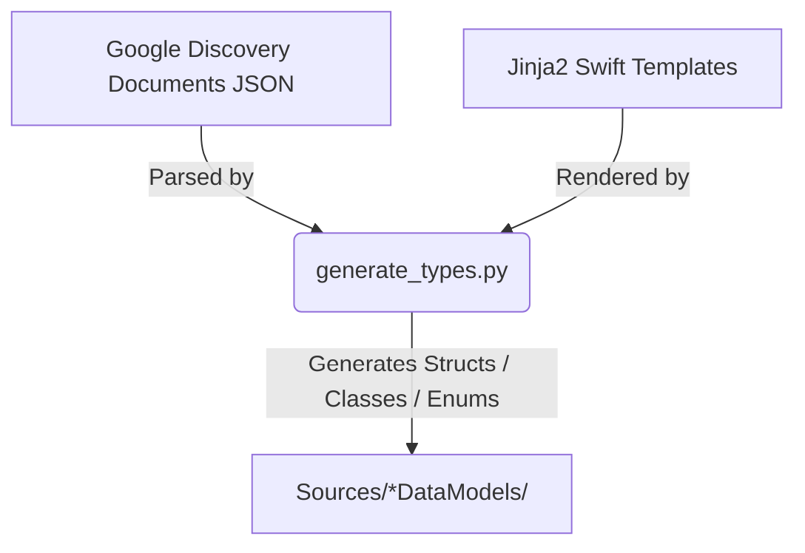

# Code Generation Utilities

This directory contains the tools, schemas, and templates used to generate
`Codable` Swift data models for Google AI and Vertex AI platform services.

## Architecture & Code Generation Workflow

The generation pipeline translates Google API Discovery JSON documents into
type-safe, Swift-6-compliant structures:

1. **Parser & Resolver (`generate_types.py`)**:
   - Parses the JSON Discovery Documents.
   - Transitively resolves all referenced schemas starting from root
     entrypoints (e.g., `GenerateContentRequest` and
     `GenerateContentResponse`).
   - Runs a cycle-detection DFS search to generate self-referential types as
     reference classes (avoiding layout recursion errors) and standard types
     as structs.
2. **Templates (`templates/`)**:
   - Defines Jinja2 layout files for Swift `struct`, `class`, and `enum`
     types.
   - Formats documentation comments, escaping Swift reserved keywords (e.g.,
     `` `default` ``), and standardizing casings (e.g., camelCase for enums).
3. **Output Targets (`Sources/`)**:
   - Populates Swift Package Manager targets (`GoogleAIDataModels` and
     `AgentPlatformDataModels`) with modular source files, injecting target
     dependencies (e.g. `package import SharedDataModels`) dynamically.

---

## Directory Map

*   [discovery_documents/](discovery_documents/): Holds the source JSON
    documents describing the Google service APIs.
*   [scripts/](scripts/): Holds execution scripts (such as
    `generate_types.py`) to run the generator pipeline.
*   [templates/](templates/): Holds Swift source-code template structures
    parsed by the generator.
