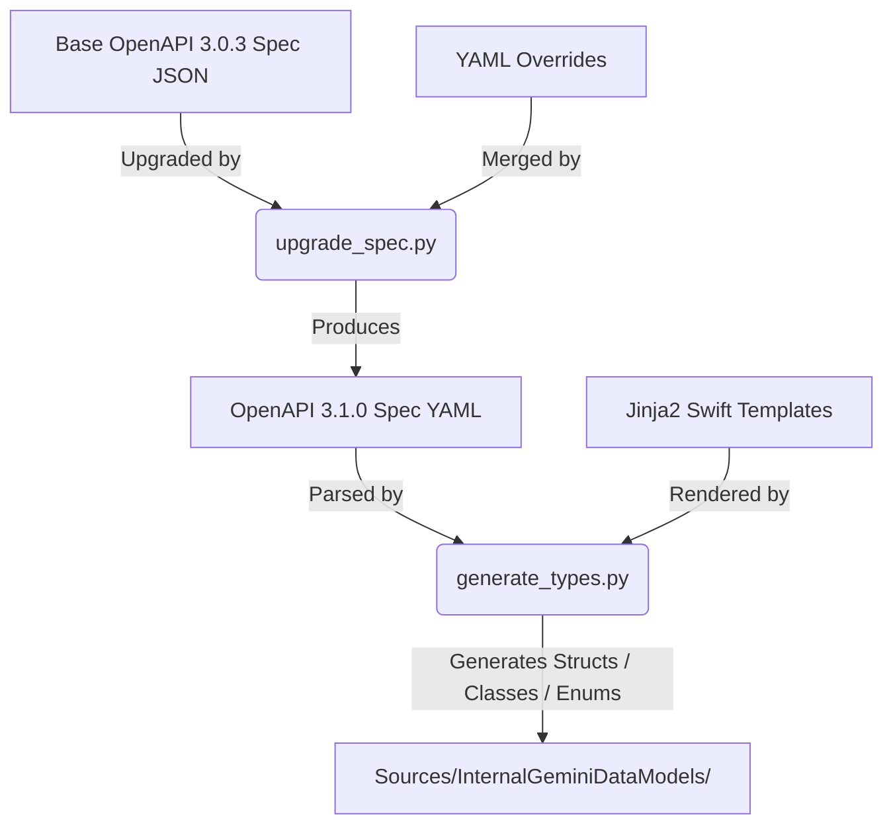

# Code Generation Utilities

This directory contains the tools, schemas, and templates used to generate
`Codable` Swift data models for Google AI and Vertex AI platform services
using an OpenAPI 3.1.0 pipeline.

## Architecture & Code Generation Workflow

The generation pipeline upgrades a base OpenAPI specification, merges custom
overrides, and translates the final OpenAPI YAML schemas into type-safe,
Swift-6-compliant structures:

1. **Spec Upgrader (`upgrade_spec.py`)**:
   - Upgrades base OpenAPI specifications (JSON) to OpenAPI 3.1.0.
   - Standardizes nullable types and simplifies `$ref` wrappers.
   - Merges custom overrides (e.g. required fields, `oneOf` arrays) from a
     YAML configuration.
   - Outputs a unified, fully standard-compliant OpenAPI 3.1.0 specification
     in YAML.
2. **Parser & Resolver (`generate_types.py`)**:
   - Parses the OpenAPI 3.1.0 YAML specification.
   - Transitively resolves all referenced schemas starting from root
     entrypoints (e.g., `GenerateContentRequest` and
     `GenerateContentResponse`).
   - Resolves required properties (marked as non-optional in Swift) and flat
     `oneOf` definitions (represented as nested associated-value enums).
   - Runs a cycle-detection DFS search to generate self-referential types as
     reference classes (avoiding layout recursion errors) and standard types
     as structs.
3. **Templates (`templates/`)**:
   - Defines Jinja2 layout files for Swift `struct`, `class`, and `enum`
     types, including custom flat `Codable` decoding/encoding synthesis for
     `oneOf` enums.
   - Compiles structured documentation comments with platform-specific headers,
     type mappings, and callouts indicating backend availability.
   - Generates constructor-level parameter documentation featuring concise
     summary lines and symbol links back to property declarations.
   - Escapes Swift reserved keywords (e.g. `` `default` ``) and standardizes
     casing formats.
4. **Output Targets (`Sources/`)**:
   - Populates Swift Package Manager target (`InternalGeminiDataModels`) with
     modular source files, injecting target dependencies (e.g. `package import
     InternalSharedDataModels`) dynamically.

---

## Directory Map

*   [discovery_documents/](discovery_documents/): Holds the source JSON
    documents describing the Google service APIs.
*   [scripts/](scripts/): Holds execution scripts (such as
    `generate_types.py`) to run the generator pipeline.
*   [templates/](templates/): Holds Swift source-code template structures
    parsed by the generator.
